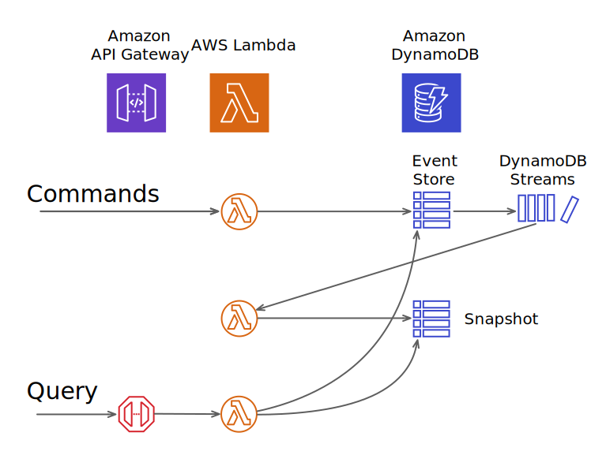

# Serverless Event Soutcing

Event Sourced Inventory Solution using AWS Serverless    
(Event Sourcing + CQRS)  


# AWS Services Relationship



## Deploying

### Requirements
- AWS Account
- Python 3.7 or greater
- AWS CLI latest

### Use
- AWS Lambda
- Amazon DynamoDB
- Amazon API Gateway
- AWS IAM
- AWS CloudFormation

# Instructions

These are the deployment steps until the full implementation is complete.:

1. Clone this repository locally.
2. Execute the following command in a terminal running python3.

__Set variables__  
```bash
$ PROJECTNAME=eventsoucing
$ YOURNAME=yagita
```

__Create a bucket to upload lambda functions.__
```bash
$ aws s3 mb s3://$YOURNAME-$PROJECTNAME
```

__Install python package.__
```bash
$ cd lambda/layer/python
$ pip install -r requirements.txt -t .
$ cd ../../..
```

__Upload local artifacts__
```bash
$ aws cloudformation package \
    --template-file template.yml \
    --s3-bucket $YOURNAME-$PROJECTNAME \
    --output-template-file packaged.yml

$ aws cloudformation deploy \
    --stack-name EventSoucing \
    --region ap-northeast-1 \
    --template-file packaged.yml \
    --capabilities CAPABILITY_NAMED_IAM \
    --output text
```

# How to Test

__E2E Test__  

1. Test that raises commands.  
```bash
$ aws lambda invoke \
    --function-name TestEventSourceFunction \
    --region ap-northeast-1 \
    --payload '{}' \
    response.json
```

2. Query Inventory  
```bash
$ curl -X GET 'https://xxxxxxxxxxx.execute-api.ap-northeast-1.amazonaws.com/Stage/inventory?item_id=00000001'
```
